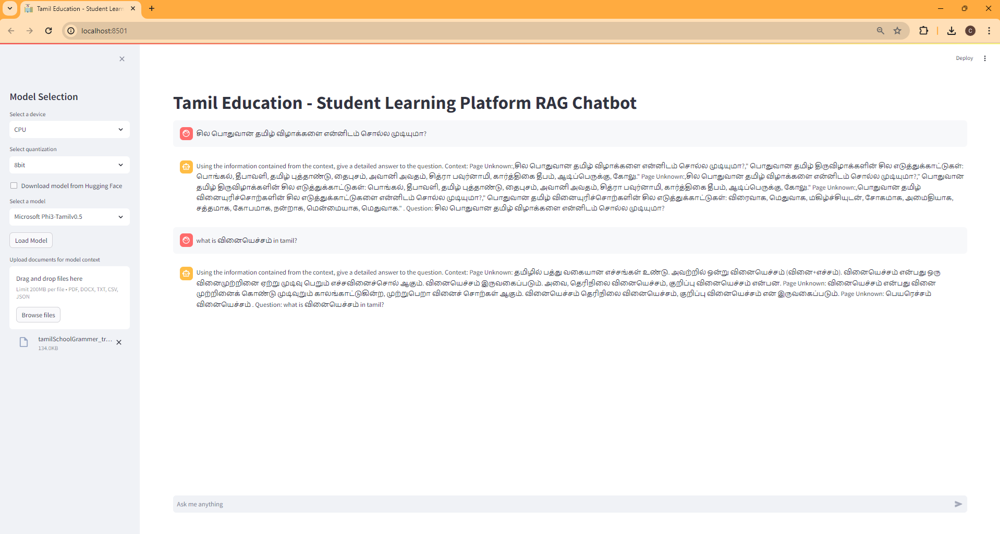

Steps to run the RAG version for Tamil Education Kids Learning Platform

This is allowing user/student to upload their text book and asking kids/parents and students to use the text book content and publicly trained tamil LLM. This is allowing students to learn tamil with examples potentially by generation context based text, image and video.

The current version works with Phi3 Tamil v0.5 and LLaMA3 Tamil v0.5. These models are fine tuned with additional tamil grammer, tamil text books based on grade level.

It also allows user to select the device (CPU/CUDA) and allows user to upload the local document like text, csv or PDF versions. Currently output is based on unicode and some Tamil fonts require more work.

RAG system creates the embedding, and stores in vector db. Based on the content size, it will take time to upload the content and based on user query,searching in the local document (retrieve) and create a context (augument) and intract with LLM with context to generate the response.

Steps to run:

Tested with python3.9. If the user wants to run on GPU, make sure CUDA drivers are installed.

Create a virtual environment and activate it.

#pip install -r requirements.txt

#streamlit run app.py

First time users need a model and you can download the model from huggingface. We have released the finetuned model using the Tamil Grammer related dataset in huggingface. The following models are available to use:
    "Microsoft Phi3-Tamilv0.5": "niranjanramarajar/Phi3-Tamil-v0-5",
    "LLaMA3 Tamilv05": "niranjanramarajar/Llama-3-Tamil-v0-5"

In order to download the model, you need to provide the access token from huggingface. Once model is downloaded, it will be availabe for further usage. Use can decide to run on difference devices and allowing user to choose different quantization based model.

Once model downloaded and loaded, user can select any Tamil documents, like text book (PDF or TXT or CSV or Word etc). After it is uploaded, now embeddings are available for reterieve, based on the user query, it can augument and generate the response using the context that augumented from local document and generate response using LLM.

After experiments are completed, the virtual environment can be deactivated